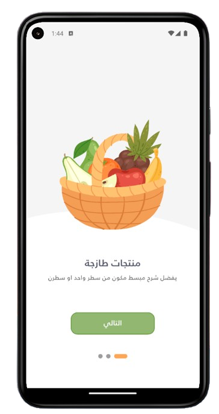
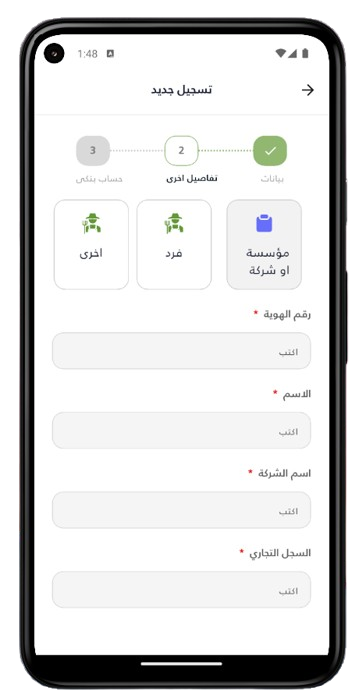
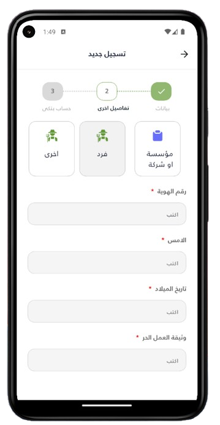
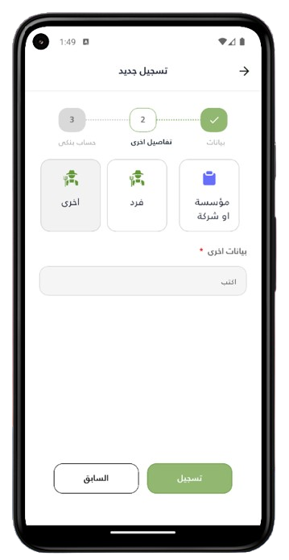
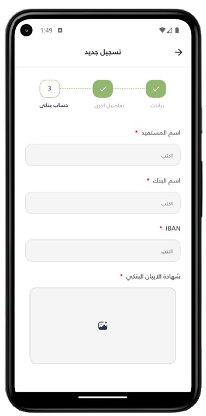
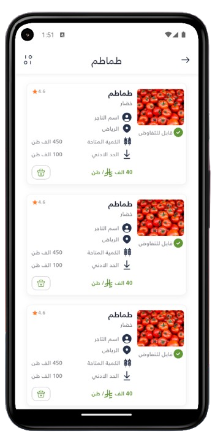
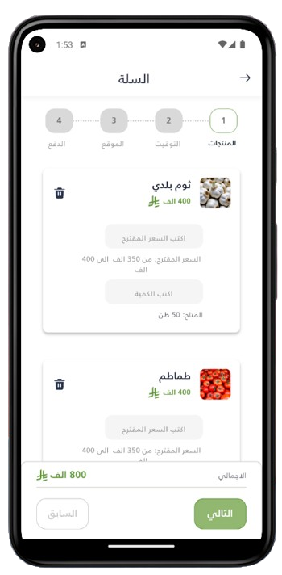

# 🥦 agricultural_crops_app

A modern Flutter application for shopping and managing vegetables and groceries.  
Built with **Clean Architecture** and **Cubit** for scalable, maintainable, and reactive state management.

---

## 🎬 Preview

The app follows a smooth and guided flow for users:

- 🚀 Starts with a **Splash Screen** introducing the app.  
- 📖 A set of **3 Onboarding Screens** to explain features and guide new users.  
- 🔑 Secure login process across **2 Login Screens**.  
- 📝 Complete account creation with **5 Register Screens**, ensuring detailed and structured user input.  
- 🏠 Main **Home Screen** with navigation to categories and products.  
- 📂 **Categories Details Screen** to explore available product groups.  
- 📦 **Product Details Screen** for a closer look at individual items.  
- 🛒 **4 Basket Screens** to manage cart items, checkout flow, and review.  
- 🎉 A final **Ok Screen** to confirm successful actions (e.g., order placed).

---

## 📸 Screenshots (All 19 images)

### Splash
| Splash |
|--------|
|  |

### Onboarding (3)
| Onboarding 1 | Onboarding 2 | Onboarding 3 |
|--------------|--------------|--------------|
|  |  |  |

### Login (2)
| Login 1 | Login 2 |
|--------:|--------:|
|  |  |

### Register (5)
| Register 1 | Register 2 | Register 3 | Register 4 | Register 5 |
|------------|------------|------------|------------|------------|
|  |  |  |  |  |

### Home / Categories / Product
| Home | Categories Details | Product Details |
|------|-------------------:|----------------:|
|  |  |  |

### Basket (4)
| Basket 1 | Basket 2 | Basket 3 | Basket 4 |
|----------|----------|----------|----------|
|  |  |  |  |

### Ok / Final
| Ok Screen |
|-----------|
|  |


---

## ✅ Features

- 🧠 **Clean Architecture + Cubit** for well-structured layers and predictable, testable state handling.  
- 🎨 **Rich animations & smooth transitions** between screens for a delightful UX.  
- 🔑 Step-by-step **Login & Register flows** distributed across multiple screens for clarity.  
- 🛒 Robust **shopping workflow**: add to cart, edit quantities, review, and checkout across multiple basket steps.  
- 📱 **Responsive UI** that adapts to phones and tablets.  
- 🌙 **Dark mode support** (toggle-ready).  
- 🈯 **Multi-language support** ready (easy to add translations).  
- 🔔 Basic **notifications** scaffolding (local push hooks) prepared.  
- ♻️ Clean folder structure — easy to maintain and scale.

---

## 🧠 Architecture (high level)

- **Presentation Layer**
  - `screens/` — Splash, Onboarding (1-3), Login (1-2), Register (1-5), Home, CategoriesDetails, ProductDetails, Basket (1-4), Ok.
  - `widgets/` — Reusable UI components and animation widgets.
  - `cubit/` — Cubits and states for presentation logic.

- **Domain Layer**
  - `entities/` — Core business models.
  - `usecases/` — Application-specific operations.

- **Data Layer**
  - `repositories/` — Interfaces and implementations.
  - `datasources/` — Remote (API) and local (DB/cache).

- **Core**
  - `utils/`, `helpers/`, and `constants/` for shared utilities and theme.

---

## 🚀 Getting Started

1. Clone the repository:
```bash
git clone https://github.com/AhmedMohamed195/agricultural_crops_app.git
cd agricultural_crops_app
